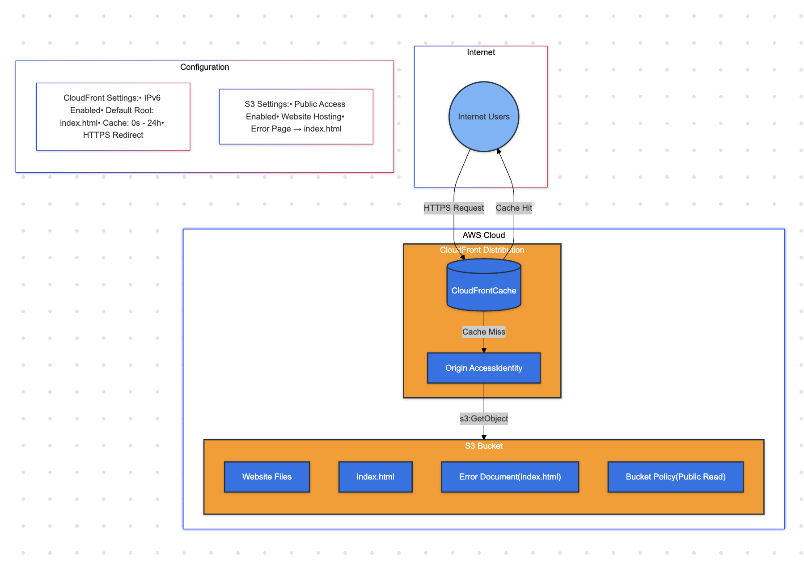

# Personal Website

A modern, responsive personal portfolio website built with React and TypeScript.


## 🛠 Tech Stack

- **Frontend Framework:** React 18
- **Language:** TypeScript
- **Package Manager:** Yarn
- **State Management:** React Context API
- **Testing:** Jest & React Testing Library
- **Linting:** ESLint
- **Code Formatting:** Prettier

## ☁️ Infrastructure

The website is hosted on AWS using a modern, scalable architecture managed with Terraform.

### Cloud Components

- **S3**: Static website hosting
- **CloudFront**: Global CDN distribution
- **Route53**: DNS management
- **ACM**: SSL certificate management

### Infrastructure Diagram



### Infrastructure Features

- **Global Content Delivery**: CloudFront CDN ensures low-latency access worldwide
- **Secure Access**: HTTPS-only access with automatic HTTP to HTTPS redirection
- **SPA Support**: Custom error handling for Single Page Application routing
- **Cost-Effective**: Pay-as-you-go pricing with high scalability
- **Version Control**: Infrastructure as Code using Terraform

## 🚀 Getting Started

### Prerequisites

- Node.js (v16 or higher)
- Yarn package manager

### Installation

1. Clone the repository
```bash
git clone https://github.com/brice-aldrich/my-website.git
cd my-website
```

2. Install dependencies
```bash
yarn install
```

3. Start the development server
```bash
yarn dev
```

4. Build for production
```bash
yarn build
```

## 📂 Project Structure

```
src
├── App.css
├── App.test.tsx
├── App.tsx
├── components
│   ├── AboutSection.tsx
│   ├── ContactSection.tsx
│   ├── FooterSection.tsx
│   ├── MainSection.tsx
│   ├── SkillIcons.tsx
│   ├── SkillsSection.tsx
│   ├── TopBar.tsx
│   └── WorkHistorySection.tsx
├── index.css
├── index.tsx
├── logo.svg
├── react-app-env.d.ts
├── reportWebVitals.ts
├── setupTests.ts
└── theme
    └── theme.tsx
```

## 📱 Features

- Responsive design that works on all device sizes
- Animations
- Contact form

## 🔧 Scripts

- `yarn dev`: Start development server
- `yarn build`: Build for production
- `yarn preview`: Preview production build
- `yarn lint`: Run ESLint
- `yarn format`: Format code with Prettier
- `yarn type-check`: Run TypeScript type checking

## 🤝 Contributing

While this is a personal website, I welcome any suggestions or improvements. Feel free to:

1. Fork the repository
2. Create a feature branch (`git checkout -b feature/improvement`)
3. Commit your changes (`git commit -am 'Add some improvement'`)
4. Push to the branch (`git push origin feature/improvement`)
5. Open a Pull Request

## 📝 License

This project is open source and available under the [MIT License](LICENSE.md).

## 📞 Contact

Feel free to reach out if you have any questions or suggestions:

- GitHub: [@brice-aldrich](https://github.com/yourusername)
- LinkedIn: [Brice Aldrich](https://www.linkedin.com/in/brice-aldrich-1046bb85/)
- Email: me@bricealdrich.com

---

Made with ❤️ using React & TypeScript